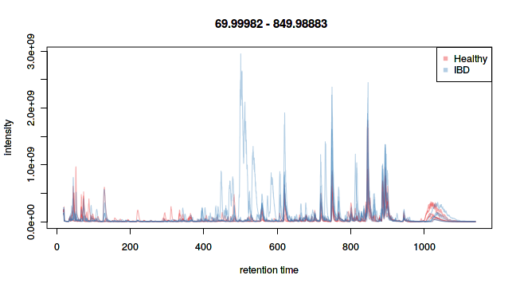
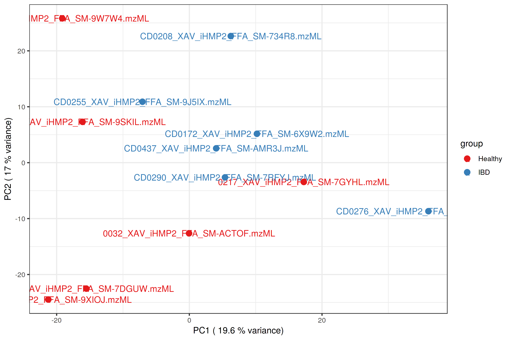
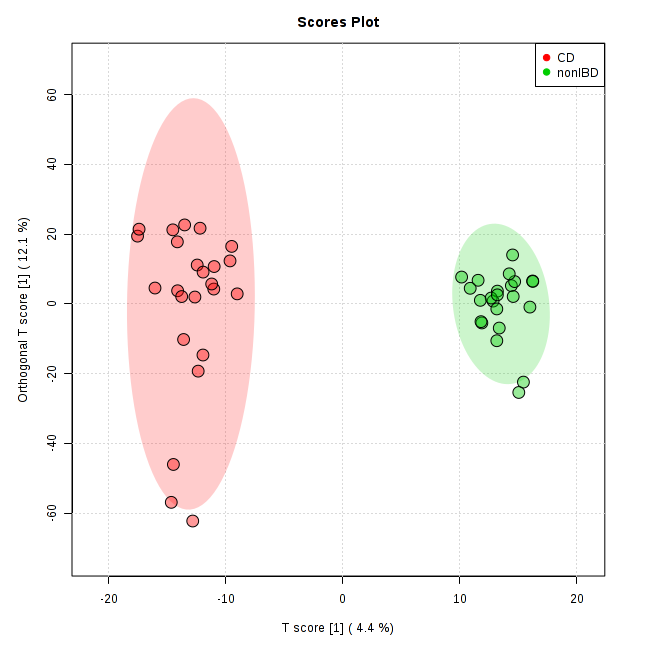
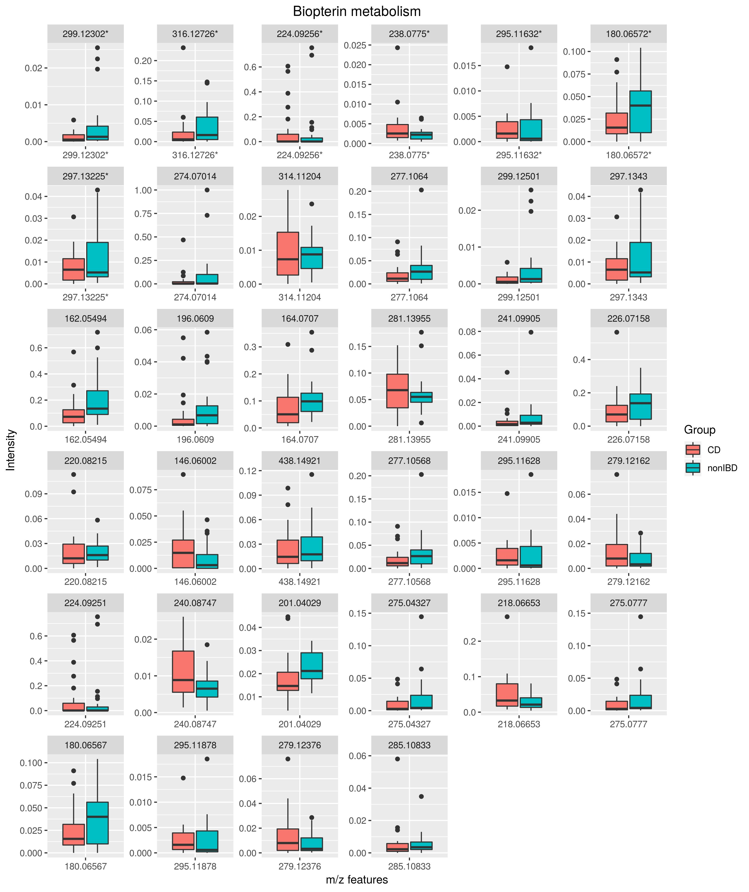

## 1. Introduction

We present MetaboAnalystR 2.0, which aims to address two important gaps left in its previous version. First, raw spectral processing - the previous version offered very limited support for raw spectra processing and peak annotation. Therefore, we have implemented comprehensive support for raw LC-MS spectral data processing including peak picking, peak alignment and peak annotations. Second, we have enhanced support for functional interpretation directly from m/z peaks. In addition to an efficient implementation of the mummichog algorithm (PMID: 23861661), we have added a new method to support pathway activity prediction based on the well-established GSEA algorithm (PMID: 16199517). In this tutorial, we showcase how to utilize MetaboAnalyst 2.0 to perform a comprehensive end-to-end metabolomics data workflow. The dataset consists of a subset of pediatric IBD stool samples obtained from the Integrative Human Microbiome Project Consortium (https://ibdmdb.org/).

## 2. Raw MS Data Preprocessing

Three main wrapper functions have been implemented for metabolomics data processing based on XCMS (PMIDs: 16448051, 19040729, and 20671148; version 3.4.4) and CAMERA (PMID: 22111785; version 1.38.1) including: (i) the *ImportRawMSData* function for reading in raw data files, (ii) the *PerformPeakProfiling* function for peak picking and alignment, and (iii) the *PerformPeakAnnotation* function for peak annotation. These functions are described below in further detail.

The *ImportRawMSData* function reads in raw MS data files and saves it as an OnDiskMSnExp object. The function outputs two plots - the Total Ion Chromatogram (TIC) which provides an overview of the entire spectra, and the Base Peak Chromatogram (BPC) which is a cleaner profile of the spectra based on the most abundant signals. These plots are useful to inform the setting of parameters downstream. For users who wish to view a peak of interest, an Extracted Ion Chromatogram (EIC) can be generated using the *PlotEIC* function.

The *PerformPeakProfiling* function is a wrapper of several XCMS R functions that performs peak detection, alignment, and grouping in a single step. The resulting peaks are outputted as a XCMSnExp object. The function also generates two diagnostic plots including a retention time adjustment map, and a PCA plot showing the overall sample clustering prior to data cleaning and statistical analysis. Users can specify several parameters such as the mass accuracy, peak width, and retention time range using the SetPeakParam function to optimize the peak picking function.

The *PerformPeakAnnotation* function annotates isotope and adduct peaks using the CAMERA R package (PMID: 22111785). It outputs the result as a CSV file (“annotated_peaklist.csv”) and saves the annotated peaks as an xsAnnotate object. Finally, the peak list is formatted to the correct structure for MetaboAnalystR and filtered based upon user’s specifications using the *FormatPeakList* function. This function permits the filtering of adducts (i.e. removal of all adducts except for [M+H]+/[M-H]-) and filtering of isotopes (i.e. removal of all isotopes except for monoisotopic peaks). The goal of filtering peaks is to remove degenerative signals and reduce the file size.

### 1.1 Example data download

Prior to starting this tutorial, please download the 12 example mzML files, containing fecal samples from 6 pediatric IBD patients and 6 healthy controls. These patients are all male, aged 11-16 years old. The data is available for download here: https://www.dropbox.com/s/1v0a9b3y6pe0cbl/iHMP.zip?dl=0. Ensure that you unzip this folder and set your file path in the *ImportRawMSData* function to this new folder.

### 1.2 Preprocessing of example data

We will first import the raw MS data using the *ImportRawMSData* function. Set the path to the iHMP folder, which contains two subfolders labelled "Healthy" and "IBD". Note that the names of the subfolders will be used as the group names for the samples. In this case, the healthy folder contains 6 samples which are the healthy controls, and the IBD folder contains 6 samples which are IBD patients - denoted with a CD at the beginning of their file names. In *ImportRawMSData*, the format refers to the format of the resulting TIC and BPC plots (i.e. "png", "jpg"), the dpi refers to the resolution (typically 300 dpi is required for publication quality images), and width refers to the size of the plot. All plots generated in MetaboAnanlystR can be found within your current working directory. For the sake of the tutorial, images that were generated using this workflow are directly inserted using "insert_graphic()".   

The subset of 12 IBD samples used in this vignette were run on a Dell XPS 15 9570 laptop with a dual-booted Ubutnu 16.04 and 16 GB of ram. When this workflow was initially run, 13.6/16 GB of memory was used during peak picking, as xcms uses multi-core parallel processing, and therefore the workflow failed. Therefore to avoid potential memory issues on a user's desktop/laptop, the *ImportRawMSData* function will limit the number of cores used. By default, it will determing the number of cores on a user's computer and set the number of cores to half of that number. Users who wish to overwrite this can use register(bpstart(MulticoreParam(num_cores))) after *ImportRawMSData*.

```{r, eval=FALSE}

# Load the MetaboAnalystR package
library("MetaboAnalystR")

# Import mzML files, set path to folder containing two subfolders of samples 
rawData <- ImportRawMSData("~/Desktop/MetaboAnalystR_workflow/MetaboAnalystR_workflow_iHMP/iHMP", 
                            format = "png", dpi = 72, width = 9)

```

Resulting TIC plot:

```{r, out.width = "70%"}
knitr::include_graphics("TICS_72.png")
```

Resulting BPIS plot:

```{r, out.width = "70%"}

```

Next, we will set the parameters for peak picking using the *SetPeakParam* function. This function sets all the parameters used for downstream pre-processing of user's raw MS data such as the mass error (ppm), signal to noise threshold, and bandwidth. Use ?SetPeakParam for further information of all available parameters. In this case, we set the mass error to 5. Following the setting of parameters, we will use the *PerformPeakProfiling* function to perform peak picking, grouping, retention time correction, and alignment. 

```{r, eval=FALSE}
# Set parameters for peak profiling
peakParams <- SetPeakParam(ppm = 5)

# Perform peak profiling
extPeaks <- PerformPeakProfiling(rawData, peakParams, rtPlot = TRUE, pcaPlot = TRUE, labels = TRUE,
                               format = "png", dpi = 300, width = 9)

```

Resulting PCA plot:

```{r, out.width = "70%"}

```

The *PerformPeakProfiling* function outputs a PCA plot of the detected peaks per sample. Note that this function provides an option for users to label the points or not (labels = TRUE). From this plot, we can see an ok separation between the Healthy and IBD patients. Remember that this workflow utilizes only a subset of patients, and for good results, the number of samples should be maximized.

Following peak profiling we will perform peak annotation. First, set the parameters for peak annotation using the *SetAnnotationParam* function. In this case, specify that the samples were collected in negative ion mode - "negative", and the allowed variance for the search (for adduct annotation) to 0.005 m/z. Next, use the *PerformPeakAnnotation* function to annotate the detected peaks to potential isotopes and  adducts. This will output a csv file named "annotated_peaklist.csv", which contains the entire list of all identified m/z features, their retention time, and their annotations. In this case, we identified ~11000 features. Finally, use the *FormatPeakList* function to format this annotated_peaklist into the correct format to be used by MetaboAnalystR (and the web version). In this function, users can choose to filter the peaks, i.e. remove features that are missing in more than 75% of features per group and filter out all isotopes. The function will output a file named "metaboanalyst_input.csv", which will be used to read in the peak table. It also outputs the "filtered_peaklist.csv", which contains a column named "Pklist_inx", which provides users with the row number of where to find the m/z feature in the "annotated_peaklist.csv". 

```{r, eval=FALSE}
# Set parameters for peak annotation
annParams <- SetAnnotationParam(polarity = "negative", mz_abs_add = 0.005)

# Perform peak annotation
annotPeaks <- PerformPeakAnnotation(extPeaks, annParams)

# Format and filter the peak list for MetaboAnalystR
maPeaks <- FormatPeakList(annotPeaks, annParams, filtIso = TRUE, filtAdducts = FALSE,
                          missPercent = 0.75)

```

## 3. Data Processing and Statistical Analysis

Remaining in the same working directory, we will read in the filtered peak table. Then, we will replace missing values with a small value (half of the minimum positive value within the original data). Next we will filter varibles out non-informative signals, then normalize the samples to their median and perform log transformation. Finally, we will perform t-test analysis to identify differentially enriched features, setting the FDR-adjusted p-value threshold to 0.25.

```{r, eval=FALSE}
# Initialize the mSetObj
mSet<-InitDataObjects("pktable", "stat", FALSE)

# Read in the filtered peak list
mSet<-Read.TextData(mSet, "metaboanalyst_input.csv", "colu", "disc")

# Perform data processing
mSet<-SanityCheckData(mSet)
mSet<-ReplaceMin(mSet);
mSet<-FilterVariable(mSet, "iqr", "F", 25)
mSet<-PreparePrenormData(mSet)
mSet<-Normalization(mSet, "MedianNorm", "LogNorm", "NULL", ratio=FALSE, ratioNum=20)

# Perform t-test
mSet<-Ttests.Anal(mSet, F, 0.25, FALSE, TRUE)

```

## 4. From Raw Peaks to Biological Insights

Even with high mass accuracy afforded by the current high-resolution MS platforms, it is often impossible to uniquely identify a given peak based on its mass alone. To get around this issue, a key concept is to shift the unit of analysis from individual compounds to individual pathways or a group of functionally related compounds (i.e. metabolite sets (PMID: 20457745)). The general assumption is that the collective behavior of a group is more robust against a certain degree of random errors of individuals. The mummichog algorithm is the first implementation of this concept to infer pathway activities from a ranked MS peaks identified in untargeted metabolomics. This algorithm is available in MetaboAnalystR (the *PerformMummichog* function). The original algorithm implements an over-representation analysis (ORA) method to evaluate pathway-level enrichment based on significant features. Users need to specify a pre-defined cutoff based on either t-statistics or fold changes. A complementary approach is the Gene Set Enrichment Analysis (GSEA) method, a widely used method to extract biological meaning from a ranked gene list (PMID: 16199517). Unlike ORA, this method considers the overall ranks without using a significance cutoff. It is able to detect subtle and consistent changes which can be missed from ORA methods. The MetaboAnalystR 2.0 offers GSEA (the *PerformGSEA function*) using the high-performance fgsea R package (https://www.biorxiv.org/content/10.1101/060012v1).

To perform these analyses, users must upload a table containing three columns - m/z features, p-values, and t-scores or fold-change values. In this case, as we performed t-test analysis on the peak table, we can use the new function *Convert2Mummichog*, which converts the results of the t-test to the proper format for mummichog analysis. The output of this function is a file titled "mummichog_input_XX.txt", with XX replaced by the current date. 

Next, we follow the typical MS Peaks to Pathways workflow, setting the instrument options to "negative" and the p-value cut-off to 0.25. Then, we will perform the original mummichog algorithm, using the *PerformMummichog* function. We will select the hsa_mfn library, and set the permutations to 1000. This may take some time. 

```{r, eval=FALSE}

# Convert the output of the t-test to the proper input for mummichog analysis
mSet<-Convert2Mummichog(mSet)

# Read in the ranked peak list (don't forget to change the file name!)
mSet<-Read.PeakListData(mSet, "mummichog_input_2019-03-06.txt");
mSet<-UpdateMummichogParameters(mSet, "5", "negative", 0.25);
mSet<-SanityCheckMummichogData(mSet)

# Perform original mummichog algorithm
mSet<- PerformMummichog(mSet, "hsa_mfn", permNum = 1000)

# View the top pathway hits using head(mSet$mummi.resmat)
# > head(mSet$mummi.resmat)
#                                                   Pathway total Hits.total Hits.sig      EASE        FET     Gamma
# Vitamin E metabolism                                         54         33        4 0.0054183 0.00049465 0.0010642
# Linoleate metabolism                                         46         20        1 1.0000000 0.21962000 1.0000000
# Carnitine shuttle                                            72         20        1 1.0000000 0.21962000 1.0000000
# Androgen and estrogen biosynthesis and metabolism            95         65        1 1.0000000 0.55974000 1.0000000
# Drug metabolism - cytochrome P450                            53         42        1 1.0000000 0.40860000 1.0000000
# Ascorbate (Vitamin C) and Aldarate Metabolism                29         19        1 1.0000000 0.20981000 1.0000000
```

Now we will perform GSEA, using the *PerformGSEA* function. This function is much faster than the original implementation. As you can see, Vitamin E metabolism is consistently identified between the two algorithms. Vitamin E has been shown to be decreased in patients with Crohn's disease (PMID: 22488830) and were shown to have anti-inflammatory properties (PMID: 30237488). We can visualize the comparison of the pathway analysis results of the two algorithms with a scatter plot using the *PlotIntegPaths* function. This function will check that you performed both methods (original mummichog + GSEA), and that both methods used the same selected pathway library. The labels parameter sets whether all, none, or some of the top-ranked pathways should be annotated on the plot. If set to "default", the function will generate a plot with the top 5 ranked pathways identified using GSEA or mummichog annotated. The number of top ranked pathways can be adjusted using "labels.x" and "labels.y". Finally, the pathways on the plot are colored and sized based on their combined p-values (Fisher's method). The combined p-values are saved as a CSV file in your working directory ("mummichog_combined_pathway_enrichment.csv").

```{r, eval=FALSE}
# Perform GSEA 
mSet<- PerformGSEA(mSet, "hsa_mfn", permNum = 1000)

# View the top pathway hits using head(mSet$mummi.gsea.resmat)
# > head(mSet$mummi.gsea.resmat)
#                                                   Pathway_Total Hits P_val    P_adj   NES      
# Linoleate metabolism                              "46"          "1"  "0.998"  "0.998" "-0.4419"
# Carnitine shuttle                                 "72"          "1"  "0.998"  "0.998" "-0.2882"
# Vitamin E metabolism                              "54"          "4"  "0.8219" "0.998" "-0.7053"
# Androgen and estrogen biosynthesis and metabolism "95"          "1"  "0.998"  "0.998" "0.3674" 
# Drug metabolism - cytochrome P450                 "53"          "1"  "0.998"  "0.998" "0.276"  
# Ascorbate (Vitamin C) and Aldarate Metabolism     "29"          "1"  "0.998"  "0.998" "-0.6419"

# Plot with the top 5 pathways found in both algorithms annotated
mSet <- PlotIntegPaths(mSet, dpi = 300, width = 10, format = "jpg", labels = "default")

```

## 4.1 MetaboAnalystR 2.0 IBD Case Study

In this vignette, we demonstrated the workflow using a subset of IBD patients and healthy controls. In our manuscript "MetaboAnalystR 2.0: From Raw Spectra to Biological Insights", we performed this entire workflow using 24 pediatric IBD and 24 healthy controls. The entire R history, resulting annotated peak list, and filtered peak table are available for download from: https://github.com/jsychong/MetaboAnalystR/tree/master/MetaboAnalystR_2_Supplementary_Data

To recreate our findings in the manuscript, using the provided peak table from the GitHub repository, use the following code snippet. Ensure that the "iHMP2_48_metaboanalyst_input.csv" file is located in your current working directory.

```{r, out.width = "70%"}

# Read in the peak table, perform data processing
mSet<-InitDataObjects("pktable", "stat", FALSE)
mSet<-Read.TextData(mSet, "iHMP2_48_metaboanalyst_input.csv", "colu", "disc")
mSet<-SanityCheckData(mSet)
mSet<-ReplaceMin(mSet);
mSet<-FilterVariable(mSet, "iqr", "F", 25)
mSet<-PreparePrenormData(mSet)
mSet<-Normalization(mSet, "MedianNorm", "LogNorm", "AutoNorm", ratio=FALSE, ratioNum=20)

# View the OPLS-DA plot
mSet<-OPLSR.Anal(mSet, reg=TRUE)
mSet<-PlotOPLS2DScore(mSet, "opls_score2d_0_", "png", 72, width=NA, 1,2,0.95,0,0)



# Re-perform normalization, without auto-scaling 
mSet<-Normalization(mSet, "MedianNorm", "LogNorm", "NULL", ratio=FALSE, ratioNum=20)

# Perform t-test
mSet<-Ttests.Anal(mSet, F, 0.05, FALSE, TRUE)

# Convert results to mummichog analysis
mSet<-Convert2Mummichog(mSet)

# RENAME FILE TO CREATED mummichog_input
mSet<-Read.PeakListData(mSet, "mummichog_input_2019-03-18.txt");
mSet<-UpdateMummichogParameters(mSet, "5", "negative", 0.25);
mSet<-SanityCheckMummichogData(mSet)

# First perform original mummichog algorithm
mSet<- PerformMummichog(mSet, "hsa_mfn", permNum = 1000)

# View the top enriched pathways
# > head(mSet$mummi.resmat)
#                                         Pathway total Hits.total Hits.sig      EASE       FET      Gamma
# Bile acid biosynthesis                             82         52       29 0.0062805 0.0028215 0.00027637
# Vitamin E metabolism                               54         33       20 0.0094632 0.0035614 0.00028122
# Fatty Acid Metabolism                              63         11        9 0.0152200 0.0026797 0.00029021
# Vitamin D3 (cholecalciferol) metabolism            16         10        8 0.0314750 0.0061618 0.00031722
# De novo fatty acid biosynthesis                   106         15       10 0.0520170 0.0162020 0.00035507
# Fatty acid activation                              74         15       10 0.0520170 0.0162020 0.00035507

mSet<- PerformGSEA(mSet, "hsa_mfn", permNum = 1000)

# > head(mSet$mummi.gsea.resmat)
#                                                           Pathway_Total Hits P_val      P_adj    NES     
# Bile acid biosynthesis                                    "82"          "29" "0.001894" "0.1477" "-1.949"
# Vitamin D3 (cholecalciferol) metabolism                   "16"          "10" "0.01465"  "0.5714" "-1.67" 
# Biopterin metabolism                                      "22"          "7"  "0.02214"  "0.5756" "-1.597"
# Putative anti-Inflammatory metabolites formation from EPA "27"          "4"  "0.06765"  "0.7451" "1.45"  
# Androgen and estrogen biosynthesis and metabolism         "95"          "11" "0.08318"  "0.7451" "-1.476"
# Arachidonic acid metabolism                               "95"          "8"  "0.08497"  "0.7451" "1.417" 

# View plot with no dots labeled
# mSet <- PlotIntegPaths(mSet, dpi = 300, width = 10, format = "jpg", labels = "none")

# View plot with important pathways labeled
mSet <- PlotIntegPaths(mSet, dpi = 300, width = 10, format = "jpg", labels = "default")

knitr::include_graphics("integ_path_plotdpi300.jpg")

```

Using the original mummichog algorithm, the top enriched pathways are bile acid biosynthesis and Vitamin E metabolism. Both metabolic pathways are known to be perturbed in IBD patients. Using the GSEA algorithm, the top enriched pathways are bile acid biosynthesis and Vitamin D3 metabolism. When we plot the results of both pathway analysis results, we can see that by looking at the size and color of the dots (representing each pathway, big + red is considered most significant), bile acid biosynthesis is consistently shown to be perturbed in these IBD patients. Furthermore, this plot is divided into four quadrants. In the upper left quadrant (yellow) are the pathways considered significant by the mummichog algorithm, but not significant by GSEA. In the lower right quadrant (yellow) are the pathways considered significant by the GSEA algorithm but not significant using mummichog. Finally, the upper right quadrant (red) are pathways that both mummichog and GSEA consider significant. This workflow demonstrates how biological insights can be easily obtained directly from m/z peaks, without the need for a priori metabolite identification. 

## 4.2 Further exploring pathway analysis results

From the integrated pathway analysis plot, we can see that Biopterin metabolism was considered a perturbed pathway using the GSEA algorithm, but not using the mummichog algorithm. To further investigate this, we can create a boxplot of the m/z features between the IBD and control samples. Similarily, the original mummichog algorithm identified Fatty Acid Metabolism as in important pathway, but GSEA did not. Once again, we can view this using the *PlotPathwayMZHits* function.   

```{r, out.width = "70%"}
# Function to get the m/z hits from a certain metabolic pathway
mSet <- PlotPathwayMZHits(mSet, "Biopterin metabolism", format = "jpg")



mSet <- PlotPathwayMZHits(mSet, "Fatty Acid Metabolism", format = "jpg")

knitr::include_graphics("Fatty Acid Metabolism.jpg")

```
