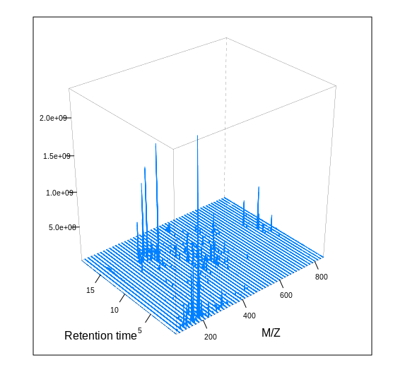
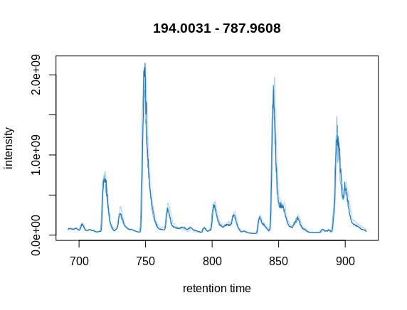
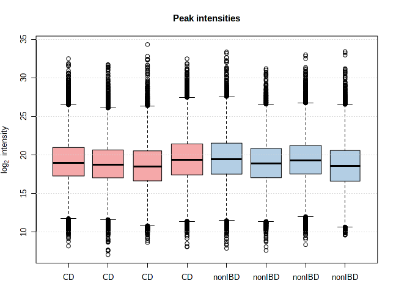
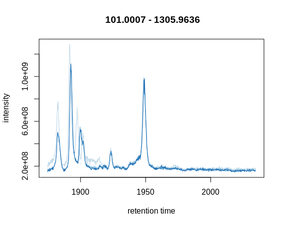

## 1. Introduction of MetaboAnalystR 3.0

**MetaboAnalystR 3.0** is aimed to optimize three important points for the whole pipeline. First, raw spectral processing parameters optimization. Second, we have enhanced the ability to correct batch effect by organising different algorithm. In addition, strengthened support for functional interpretation directly from m/z peaks via mummichog2 (PMID: 23861661) by integrating RT to refine the grouping of signals. To demonstrate this new functionality, we provide the "MetaboAnalystR 3.0 Workflow: Enhanced Global Metabolomics Analysis" vignette here. 

In this vignette, we are going to perform end-to-end metabolomics data analysis on (Case 1) example samples of clinical IBD samples from <https://www.ibdmdb.org/> and (Case 2) standards' mixture (PMID: 29907290). Case 1 is series facel samples from IBD (including CD and UC) and nonIBD controls. Case 2 is a dataset comprimised of 1100 standard compounds under the detection of UPLC-Q/E.

## 2. Case Study 1
Inflammatory bowel diseases, which include Crohn’s disease and ulcerative colitis, have affected several million individuals around the world. Jason L. et al. have performed a longtitude multiomics study on the role of microbiome in the pathogenesis of IBD. Metabolomics study on the facal samples is introduced here for example case study of this novel parameters optimization pipeline.

### 2.1 Raw Data Processing
Raw data processing is the first for all metabolomics studies. MetaboAnalystR 3.0 support ".mzXML", ".mzML" and ".CDF" formats. The original formats (e.g. ".raw" and ".RAW") generated by vendors will be supported soon. You can convert your original data with ProteoWizard (PMID: 23051804) as the supported formats. Centroided data is preferred.

#### 2.1.1 Load MetaboAnalystR 3.0

If you have finished the installation and been ready to use the package. Use the library() function to load the package into R. 

```{r, eval=FALSE}
# Load the MetaboAnalystR package
library("MetaboAnalystR")
```

#### 2.1.2 Download IBD Example QC Data

The example Quality Control (QC) samples will be used for the next steps. Download the MS data for parameters' optimization at this step. To reach a goal of quicking learning and avoid the long time running for the whole samples (over 600 samples). We only provide 5 samples for each CD and nonIBD group here. If you want to repeat and verify the results in our manuscript, please go [IBD MultiOmics Database](https://www.ibdmdb.org/), download the full batch data and run them using this pipeline.

```{r}
## Setting the data depositing folder
data_folder_Sample <- "~/Data_IBD"
data_folder_QC <- "~/QC_IBD"  
```

```{r, eval=FALSE,echo=T}
# Use Google API for data downloading here. 
# Please "install.packages('googledrive')" and "install.packages('httpuv')"first.
library(googledrive);
temp <- tempfile(fileext = ".zip")
# Please authorize your google account to access the data
dl <- drive_download(
  as_id("10DBpPEWy2cZyXvmlLOIfpwqQYwFplKYK"), path = temp, overwrite = TRUE)
# Setting your own date file folder
out <- unzip(temp, exdir = data_folder_QC)
# Date files for parameters optimization are deposited below
out

```

```{r eval=FALSE,echo=T}
# Now, download the small example data for comparison between CD vs. nonIBD
temp <- tempfile(fileext = ".zip")
dl <- drive_download(
  as_id("1-wlFUkzEwWX1afRWLJlY_KEJs7BfsZim"), path = temp, overwrite = TRUE)
# Setting the date file folder
out <- unzip(temp, exdir = data_folder_Sample)
# Date files for normal processing example are deposited below
out

```

#### 2.1.3 Data Inspectation

Before running the data analysis, the general data structure and information can be inspected with *PerformDataInspect*. If there are some extremly significant contaminats, it will be discovered directly.

```{r,eval=FALSE, echo=TRUE, message=FALSE, warning=FALSE}
# Inspect the MS data via a 3D image. "res" are used to specify the resolution for the MS data.
PerformDataInspect(data_folder_QC,res = 50)
```

```{r echo=FALSE}
cat('0020a_XAV_iHMP2_FFA_PREFA02.mzXML
[1] "RT range is: 18.0985 and 1139.81 seconds !"
[1] "MZ range is: 69.999908447266 and 849.902038574219 Thomson !"')
```

```{r echo=F, fig.width = 60}

```


#### 2.1.4 Data Trimming
QC samples data trimming was performed with *PerformDataTrimming* now. There are 3 modes for data trimming. Default is Standard Simulation Method ("ssm_trim"). Under this mode, the 3D MS will trimmed from m/z demionsion firstly and then from RT deminson. rt.idx could be used to adjust the RT range for RT data reminning. The other 2 modes, which are named as "rt_specific" and "mz_specific" can be used to extract (with positive values) or remove (with negative values) some parts of the spectra. Trimmed MS file can be saved with *write = T*. The trimmed file will be save as ".mzML". The chromatogram can be plotted with *plot = T*.

```{r, eval=FALSE, message=TRUE, warning=FALSE}
# QC samples are trimmed with "ssm_trim" strategy. 
# The percentage of RT dimension retained is set as 20%.
raw_data <- PerformDataTrimming(data_folder_QC,rt.idx = 0.2)

```

```{r echo=FALSE}
cat("Data Loaded !
Data Trimming...
MS data Parsing ...
M/Z Data Trimming...
M/Z Data Trimming Done !                                                        
Trim data outside the RT bins...
Data Trimmed !                                                                  
Loading required package: RColorBrewer
Chromatogram Plotting Begin...
Data Trimming Finished !
Time Spent In Total:2.8mins
")
```

```{r echo=FALSE, fig.width=60}

```

#### 2.1.5 Initalize Parameters' Setting

Instrument specific initial parameters have been embedded. Currently, the most popular platforms that include UPLC-Q/E, UPLC-Q/TOF, UPLC-T/TOF, UPLC-Ion_trap, UPLC-Orbitrap, UPLC-G2S, HPLC-Q/TOF, HPLC-Ion_Trap, HPLC-Orbitrap and HPLC-S/Q. If your platform is not listed here, the "general" option can be applied for this setting. Both "centWave" and "matchedFIlter" modes have been configured for further processing. Besides, the specific parameters could also be set individually, if you have your own opinion about the parameters. This parameters optimization step can be skipped.

```{r, echo=TRUE,eval=F}
# Initial platform specific parameters
param_initial <- SetPeakParam(platform = "UPLC-Q/E") 

```

#### 2.1.6 Parameters' Optimization

Parameters optimization with "DoE" strategy. Initial parameters are from the optimized parameters above or the internal default parameters from embedded *SetPeakParam* function.

```{r, echo=T, eval=FALSE}
# Select relative core according to your work platform
param_optimized <- PerformParamsOptimization(raw_data, param = param_initial, ncore = 8) 
# Following results was generated at the Ubuntu 18.04.4 
# with 64 GB RAM and Interl Core i7-9700 CPU
```

```{r echo=FALSE}
cat('[1] "DoE Optimization Starting Now!"
[1] "Evaluating Noise level..."
Data Spliting Finished !                                                   
Peak Preparing Begin...
Peak Preparing Done !
[1] "Round:1"
DoE Running Begin...
Round 1 Finished !                                                         
Model Parsing...
[1] "Parameters for centWave have been successfully parsed!"
[1] "Peak Profiling Finished !"
[1] "Starting peak filling!"
Model Parsing Done !
[1] "Round:2"
DoE Running Begin...
Round 2 Finished !                                                         
Model Parsing...
[1] "Parameters for centWave have been successfully parsed!"
[1] "Peak Profiling Finished !"
[1] "Starting peak filling!"
Model Parsing Done !
No Increase Stopping !
best parameter settings:
min_peakwidth: 6.25
max_peakwidth: 44.5
mzdiff: 0.0048
snthresh: 11.5
bw: 2
Peak_method: centWave
RT_method: peakgroup
ppm: 2.12
noise: 7195.33
prefilter: 2
value_of_prefilter: 13151.02
minFraction: 0.5
minSamples: 1
maxFeatures: 100
fitgauss: FALSE
verbose.columns: FALSE
mzCenterFun: wMean
integrate: 1
extra: 1
span: 0.4
smooth: loess
family: gaussian

Optimization Finished !
Parameters Optimization Finished !
Time Spent In Total:25.1mins
')
```

#### 2.1.7 Peak Profiling

The *ImportRawMSData* function reads in raw MS data files and saves it as an OnDiskMSnExp object. Two plots can be output with *SetPlotParam* function set with "Plot = T" - the Total Ion Chromatogram (TIC) which provides an overview of the entire spectra, and the Base Peak Chromatogram (BPC) which is a cleaner profile of the spectra based on the most abundant signals. These plots are useful to inform the setting of parameters downstream. For users who wish to view a peak of interest, an Extracted Ion Chromatogram (EIC) can be generated using the *PlotEIC* function.

```{r,echo=T, eval=FALSE}
# Import raw MS data. The "SetPlotParam" parameters can be used to determine plot or not.
rawData <- ImportRawMSData(data_folder_Sample,plotSettings = SetPlotParam(Plot=F))
```

```{r, echo=FALSE}
cat('[1] "The number of CPU cores to be used is set to 6."
[1] "Successfully imported raw MS data!"')
```

The *PerformPeakProfiling* function is an updated peak processing pipeline from XCMS R functions that performs peak detection, alignment, and grouping in an automatical step. The function also generates two diagnostic plots including statistics on the total intensity of peaks in different samples, a retention time adjustment map, and a PCA plot showing the overall sample clustering prior to data cleaning and statistical analysis.

```{r,echo=T, eval=FALSE}
# Peak Profiling with optimized parameters
mSet <- PerformPeakProfiling(rawData,param_optimized$best_parameters,
                             plotSettings = SetPlotParam(Plot = T))

```

```{r,echo=F}
cat('[1] "Parameters for centWave have been successfully parsed!"
[1] "6 CPU Threads will be used for peak profiling !"
[1] "Step 1/3: Started peak picking! This step will take some time..."
ROI searching under 2.12 ppm ... Detecting chromatographic peaks in 36166 regions of interest ... OK: 9985 found.
ROI searching under 2.12 ppm ... Detecting chromatographic peaks in 46117 regions of interest ... OK: 11491 found.
ROI searching under 2.12 ppm ... Detecting chromatographic peaks in 45942 regions of interest ... OK: 11615 found.
ROI searching under 2.12 ppm ... Detecting chromatographic peaks in 47568 regions of interest ... OK: 12113 found.
ROI searching under 2.12 ppm ... Detecting chromatographic peaks in 47199 regions of interest ... OK: 12939 found.
ROI searching under 2.12 ppm ... Detecting chromatographic peaks in 39553 regions of interest ... OK: 10480 found.
ROI searching under 2.12 ppm ... Detecting chromatographic peaks in 42731 regions of interest ... OK: 13247 found.
ROI searching under 2.12 ppm ... Detecting chromatographic peaks in 38268 regions of interest ... OK: 12464 found.
[1] "Step 2/3: Started peak alignment! This step is running..."
Total of 6238 slices detected for processing... Done !
Performing retention time correction using 6252 peak groups.
Applying retention time adjustment to the identified chromatographic peaks ... Done !
Total of 6238 slices detected for processing... Done !
[1] "Step 3/3: Started peak filling! This step may take some time..."
[1] "Starting peak filling!"
Defining peak areas for filling-in...... OK
Start integrating peak areas from original files
Requesting 8318 peaks from 0393_XAV_iHMP2_FFA_SM-AMR37.mzXML ... got 4741.
Requesting 7937 peaks from 0407_XAV_iHMP2_FFA_SM-AUP8B.mzXML ... got 4553.
Requesting 8181 peaks from 0069_XAV_iHMP2_FFA_SM-9OS5Y.mzXML ... got 4796.
Requesting 9905 peaks from 0051_XAV_iHMP2_FFA_SM-9WOBP.mzXML ... got 3815.
Requesting 7114 peaks from 0027_XAV_iHMP2_FFA_SM-77FXR.mzXML ... got 3918.
Requesting 7392 peaks from 0030_XAV_iHMP2_FFA_SM-6KUCT.mzXML ... got 3933.
Requesting 7268 peaks from 0433_XAV_iHMP2_FFA_SM-9SNJ4.mzXML ... got 4166.
Requesting 8946 peaks from 0508_XAV_iHMP2_FFA_SM-9X47O.mzXML ... got 4749.
[1] "Peak picking finished successfully !"')
```

Intensity statistics of all samples.

```{r echo=FALSE, fig.width=20}

```

#### 2.1.8 Peak Annotation

The *PerformPeakAnnotation* function annotates isotope and adduct peaks with the method from CAMERA (PMID: 22111785). It outputs the result as a CSV file (“annotated_peaklist.csv”) and saves the annotated peaks to mSet object. Finally, the peak list is formatted to the correct structure for MetaboAnalystR and filtered based upon user’s specifications using the *FormatPeakList* function. This function permits the filtering of adducts (i.e. removal of all adducts except for [M+H]+/[M-H]-) and filtering of isotopes (i.e. removal of all isotopes except for monoisotopic peaks). The goal of filtering peaks is to remove degenerative signals and reduce the file size.

```{r,echo=T, eval=FALSE}
# Setting the Annotation Parameters.
annParams <- SetAnnotationParam(polarity = "negative", mz_abs_add = 0.005)
```

```{r,echo=T, eval=FALSE}
# Perform peak annotation.
annotPeaks <- PerformPeakAnnotation(mSet, annParams)
```

```{r,echo=F}
cat('[1] "Start grouping after retention time."
Created 414 pseudospectra.
Generating peak matrix...
Run isotope peak annotation
                                                                     
Found isotopes: 3142 
[1] "Start grouping after correlation."',
"Generating EIC's . ...",

'Detecting 0027_XAV_iHMP2_FFA_SM-77FXR.mzXML  ... 2162 peaks found ! 
Detecting 0030_XAV_iHMP2_FFA_SM-6KUCT.mzXML  ... 1605 peaks found ! 
Detecting 0051_XAV_iHMP2_FFA_SM-9WOBP.mzXML  ... 2086 peaks found ! 
Detecting 0069_XAV_iHMP2_FFA_SM-9OS5Y.mzXML  ... 3027 peaks found ! 
Detecting 0393_XAV_iHMP2_FFA_SM-AMR37.mzXML  ... 2560 peaks found ! 
Detecting 0407_XAV_iHMP2_FFA_SM-AUP8B.mzXML  ... 663 peaks found ! 
Detecting 0433_XAV_iHMP2_FFA_SM-9SNJ4.mzXML  ... 2284 peaks found ! 
Detecting 0508_XAV_iHMP2_FFA_SM-9X47O.mzXML  ... 1721 peaks found ! 
[1] "Warning: Found NA peaks in selected sample."
[1] "Calculating peak correlations in 414 Groups... "
[1] "Calculating graph cross linking in 414 Groups..."                     
[1] "New number of ps-groups:  9877"                                       
mSet has now 9877 groups, instead of 414 !
[1] "Generating peak matrix for peak annotation!"
[1] "Polarity is set in annotaParam: negative"
[1] "Ruleset could not read from object! Recalculate"
[1] "Calculating possible adducts in 9877 Groups... "
Successfully performed peak annotation!')

```

```{r,echo=T, eval=FALSE}
# # Format and filter the peak list for MetaboAnalystR
maPeaks <- FormatPeakList(annotPeaks, annParams, filtIso =F, filtAdducts = FALSE,
                          missPercent = 1)
```

Part of the table (first 10 rows and 2 samples) are shown below.

```{r,echo=F}
library(knitr)
d<-kable(head(read.csv("vignette_figures/metaboanalyst_input.csv",header = T),10)[,c(1:3)])
d
```


### 2.2 Data Processing and Statistical Analysis
Remaining in the same working directory, we will read in the filtered peak table. Then, we will replace missing values with a small value (half of the minimum positive value within the original data). Next we will filter varibles out non-informative signals, then normalize the samples to their median and perform log transformation. Finally, we will perform t-test analysis to identify differentially enriched features, setting the FDR-adjusted p-value threshold to 0.25.

#### 2.2.1 mSet initialized for further analysis

```{r,eval=F}
# First step is to create the mSet Object, specifying that the data to be uploaded
# is a peak table ("pktable") and that statistical analysis will be performed ("stat").
mSet<-InitDataObjects("pktable", "stat", FALSE)

```

```{r,echo=F}
cat('Starting Rserve:
 /usr/lib/R/bin/R CMD /home/xialab/R/x86_64-pc-linux-gnu-library/3.6/Rserve/libs//Rserve --no-save 


R version 3.6.3 (2020-02-29) -- "Holding the Windsock"
Copyright (C) 2020 The R Foundation for Statistical Computing
Platform: x86_64-pc-linux-gnu (64-bit)

R is free software and comes with ABSOLUTELY NO WARRANTY.
You are welcome to redistribute it under certain conditions.',
"Type 'license()' or 'licence()' for distribution details.

  Natural language support but running in an English locale

R is a collaborative project with many contributors.
Type 'contributors()' for more information and
'citation()' on how to cite R or R packages in publications.

Type 'demo()' for some demos, 'help()' for on-line help, or
'help.start()' for an HTML browser interface to help.
Type 'q()' to quit R.",

'##> SOCK_ERROR: bind error #98(address already in use)
Rserv started in daemon mode.
[1] "MetaboAnalyst R objects initialized ..."')
```

```{r,eval=F}
# Second step is to read in the filtered peak list, please set the path right first
mSet<-Read.TextData(mSet, "metaboanalyst_input.csv", "colu", "disc")

```

#### 2.2.2 Perform Data Statistics

```{r,eval=F}
# The third step is to perform data processing using MetaboAnalystR (filtering/normalization)
# Perform data processing - Data checking
mSet<-SanityCheckData(mSet)
```

```{r,echo=F}
cat('[1] "Successfully passed sanity check!"                                             
 [2] "Samples are not paired."                                                           
 [3] "2 groups were detected in samples."                                                
 [4] "Only English letters, numbers, underscore, hyphen and forward slash (/) are allowed."                 
 [5] "<font color=\"orange\">Other special characters or punctuations (if any) will be stripped off.</font>"
 [6] "All data values are numeric."                                                      
 [7] "A total of 30390 (23.6%) missing values were detected."                            
 [8] "<u>By default, these values will be replaced by a small value.</u>"                
 [9] "Click <b>Skip</b> button if you accept the default practice"                       
[10] "Or click <b>Missing value imputation</b> to use other methods"')
```

##### Data checking and Pre-processing

```{r,eval=F}
# Perform data processing - Minimum Value Replacing
mSet<-ReplaceMin(mSet);
```

```{r, eval=FALSE}
# Perform data processing - Variable Filtering and Normalization
mSet<-FilterVariable(mSet, "iqr", "F", 25)
mSet<-PreparePrenormData(mSet)
mSet<-Normalization(mSet, "MedianNorm", "LogNorm", "NULL", ratio=FALSE, ratioNum=20)
```

```{r,echo=F}
cat('[1] " Further feature filtering based on Interquantile Range Reduced to 5000 features 
based on Interquantile Range"
[1] " Further feature filtering based on Interquantile Range Reduced to 5000 features 
based on Interquantile Range"')
```

```{r,eval=F}
mSet <- PlotNormSummary(mSet, "norm_0_", "png", 72, width=NA)
mSet <- PlotSampleNormSummary(mSet, "snorm_0_", "png", 72, width=NA)
```

```{r echo=FALSE, fig.width=60}
knitr::include_graphics("vignette_figures/norm_0_dpi72.png",dpi = 120)
```

```{r,eval=F}
# The fourth step is to perform fold-change analysis
mSet <- FC.Anal.unpaired(mSet, 2.0, 0)
mSet <- PlotFC(mSet, "fc_0_", "png", 72, width=NA)
```

```{r echo=FALSE, fig.width=60}
knitr::include_graphics("vignette_figures/fc_0_dpi72.png",dpi = 120)
```

##### Univariate Analysis - t test

```{r,eval=F}
# The fifth step is to perform t-test analysis
mSet <- Ttests.Anal(mSet, F, 0.05, FALSE, TRUE)
mSet <- PlotTT(mSet, "tt_0_", "png", 72, width=NA)
```

```{r echo=FALSE, fig.width=60}
knitr::include_graphics("vignette_figures/tt_0_dpi72.png",dpi = 120)
```

```{r,echo=F}
cat('[1] "A total of 218 significant features were found."')
```

##### Multivariate Analysis - PCA

```{r,eval=F}
# The sixth step is to perform PCA
mSet <- PCA.Anal(mSet)
mSet <- PlotPCAPairSummary(mSet, "pca_pair_0_", "png", 72, width=NA, 5)
mSet <- PlotPCAScree(mSet, "pca_scree_0_", "png", 72, width=NA, 5)
mSet <- PlotPCA2DScore(mSet, "pca_score2d_0_", "png", 72, width=NA, 1,2,0.95,1,0)
mSet <- PlotPCALoading(mSet, "pca_loading_0_", "png", 72, width=NA, 1,2);
mSet <- PlotPCABiplot(mSet, "pca_biplot_0_", "png", 72, width=NA, 1,2)
mSet <- PlotPCA3DScoreImg(mSet, "pca_score3d_0_", "png", 72, width=NA, 1,2,3, 40)
```

```{r echo=FALSE, fig.width=60}
knitr::include_graphics("vignette_figures/pca_score2d_0_dpi72.png",dpi = 120)
```

```{r echo=FALSE, fig.width=60}
knitr::include_graphics("vignette_figures/pca_score3d_0_dpi72.png",dpi = 120)
```

```{r,echo=F}
cat('[1] "The Interactive 3D PCA plot has been created, please find it in mSet$imgSet$pca.3d."')
```

##### Multivariate Analysis - PLS-DA

```{r,eval=F}
# The seventh step is to perform PLS-DA
mSet <- PLSR.Anal(mSet, reg=TRUE)
mSet <- PlotPLSPairSummary(mSet, "pls_pair_0_", "png", 72, width=NA, 5)
mSet <- PlotPLS2DScore(mSet, "pls_score2d_0_", "png", 72, width=NA, 1,2,0.95,1,0)
mSet <- PlotPLS3DScoreImg(mSet, "pls_score3d_0_", "png", 72, width=NA, 1,2,3, 40)
mSet <- PlotPLSLoading(mSet, "pls_loading_0_", "png", 72, width=NA, 1, 2);
mSet <- PLSDA.CV(mSet, "L",5, "Q2")
mSet <- PlotPLS.Classification(mSet, "pls_cv_0_", "png", 72, width=NA)
mSet <- PlotPLS.Imp(mSet, "pls_imp_0_", "png", 72, width=NA, "vip", "Comp. 1", 15,FALSE)

```

```{r echo=FALSE, fig.width=20}
knitr::include_graphics("vignette_figures/pls_score2d_0_dpi72.png",dpi = 120)
```

```{r echo=FALSE, fig.width=20}
knitr::include_graphics("vignette_figures/pls_imp_0_dpi72.png",dpi = 140)
```


### 2.3 From MS peaks to Pathways

Perform T test for further MS peaks to pathway analysis
```{r, eval=FALSE}
# Perform t-test
mSet<-Ttests.Anal(mSet, F, 0.25, FALSE, TRUE)

```

```{r,echo=F}
cat('[1] "A total of 1329 significant features were found."')
```


```{r,eval=F}
mSet<-Convert2Mummichog(mSet, rt=TRUE)
mSet<-InitDataObjects("mass_all", "mummichog", FALSE)
SetPeakFormat("mprt")
mSet<-UpdateInstrumentParameters(mSet, 5, "negative");
mSet<-Read.PeakListData(mSet, "mummichog_input_your_date.txt");
mSet<-SanityCheckMummichogData(mSet)
mSet<-SetPeakEnrichMethod(mSet, "integ", version="v2")
# Please set the appropriate p value according to your data
mSet<-SetMummichogPval(mSet, 0.15)
mSet<-PerformPSEA(mSet, "hsa_mfn", "current", permNum = 100)
mSet<-PlotIntegPaths(mSet, "peaks_to_paths_", "png", 144)

```

```{r,echo=F}
cat('
[1] "MetaboAnalyst R objects initialized ..."
[1] "mprt"
[1] "Retention time tolerance is 22.7888654"
[1] "Only a small percentage (below 10%) peaks in your input peaks should be significant."                       
[2] "The algorithm works best for <u>200~500 significant peaks in 3000~7000 total peaks</u>."                    
[3] "A total of 221 or 4.41 percent signficant mz features were found based on the selected p-value cutoff: 0.05"
[1] "v2"',
"trying URL 'https://www.metaboanalyst.ca/resources/libs/mummichog/hsa_mfn.rds'",
'Content length 634759 bytes (619 KB)
downloaded 619 KB

[1] "Got 5012 mass features."
[1] "1226 matched compounds! cpd2mz"
[1] "2857 inital ECs created!"
[1] "1430 merged ECs identified!"

Attaching package: igraph

The following objects are masked from package:stats:

    decompose, spectrum

The following object is masked from package:base:

    union

[1] "352 empirical compounds identified in 1.93101406097412 seconds."
[1] "A total of 1364 of duplicates were merged."
[1] "A total of 1269 of duplicates were merged."
[1] "A total of 1269 of duplicates were merged."
[1] "A total of 1364 of duplicates were merged."
[1] "A total of 1087 of duplicates were merged."
[1] "A total of 1087 of duplicates were merged."
[1] "A total of 1364 of duplicates were merged."
[1] "A total of 1269 of duplicates were merged."
[1] "Resampling,  100 permutations to estimate background ..."')
```

```{r echo=FALSE, fig.width=80}
knitr::include_graphics("vignette_figures/peaks_to_paths_dpi144.png",dpi = 240)
```


## 3. Case Study 2
The SM dataset produced by HPLC-Q/E HF system, consists of 2 samples with 5 replicates for each sample as described by [Li et al. 2018](https://www.ncbi.nlm.nih.gov/pubmed/29907290). The original data can be downloaded from the link provided by authors in the article.


### 3.1 Load MetaboAnalystR 3.0
Library *MetaboAnalystR* package.

```{r,eval=FALSE}
# Load the MetaboAnalystR package
library("MetaboAnalystR")

```

### 3.2 Data downloading

```{r, eval=FALSE}
# Use Google API for data downloading here. 
# Please "install.packages('googledrive')" 
# and "install.packages('httpuv')"first.
library(googledrive);
temp <- tempfile(fileext = ".zip")
# Please authorize your google account to access the data
dl <- drive_download(
  as_id("1atsy-TlfJSs0sw2ZCvbkqOSAbZFYRqdy?amp%3Bts=5b8ab35f"), path = temp, overwrite = TRUE)
# Setting your own date file folder
data_folder_SM <- "/home/qiang/Downloads/SM"  
out <- unzip(temp, exdir = data_folder_SM)
# Date files for parameters optimization are deposited below
out

```

### 3.3 Data Inspectation

Before running the data analysis, we can inspect the data at first. 

```{r,eval=FALSE, echo=TRUE, message=FALSE, warning=FALSE}
# Inspect the MS data via a 3D image. "res" are used to specify the resolution for the MS data.
PerformDataInspect(data_folder_QC,res = 50)
```

```{r echo=FALSE}
cat('SA4.mzXML 
[1] "RT range is: 0.306552 and 2400.35 seconds !"
[1] "MZ range is: 99.999481201172 and 1499.99914550781 Thomson !"')
```

```{r echo=F, fig.width = 60}
knitr::include_graphics("vignette_figures/data_inspect_TJ_ori.png",dpi = 100)
```

### 3.4 Remove An Extremly High-Intensity contaminant
Obviously, there are a series extremly high intensity peaks with mz 157.035, 158.035 and 159.035. According to experiment procedure, we can easily know the peaks are generated by DMSO, the solevent used as a stock solution. In this case, if we optimize the parameters blindly, the parameters will be dominated by this contaminants. Therefore, in order to obtain an unbiased efficacy, we 'd better to remove them at beginning.

```{r,echo=T,eval=F}
# This step is used to remove the high-intensity contaminant - DMSO [2*M+H] and its isotopes
raw_data1<-PerformDataTrimming("~/train/",
                               mode = "mz_specific",
                               mz=c(seq(-157.020,-157.040,-0.0001),
                                    seq(-158.020,-158.040,-0.0001),
                                    seq(-159.020,-159.040,-0.0001)),
                               mzdiff = 200,write = T)
```

```{r,eval=F}
# This step is used to run the data trimming with "ssm" strategy
raw_data<-PerformDataTrimming("~/train/trimmed/",mode = "ssm_trim",write = F)
```

```{r,echo=F}
cat('Data Loading...
[1] "Reading MS from Trimmed_SA4.mzML begin !"
[1] "This reading finished !"                                              
[1] "Reading MS from Trimmed_SA5.mzML begin !"
[1] "This reading finished !"                                              
[1] "Reading MS from Trimmed_SB4.mzML begin !"
[1] "This reading finished !"                                              
[1] "Reading MS from Trimmed_SB5.mzML begin !"
[1] "This reading finished !"                                              
Data Loaded !
Data Trimming...
MS data Parsing ...
MS Data Pasing Done !
M/Z Data Trimming...
M/Z Data Trimming Done !                                                        
Trim data outside the RT bins...
Data Trimmed !                                                                  
Loading required package: RColorBrewer
Chromatogram Plotting Begin...
Data Trimming Finished !
Time Spent In Total:7.8mins')
```

```{r echo=F, fig.width = 60}
knitr::include_graphics("vignette_figures/datainspect.png",dpi = 120)
```

```{r echo=FALSE, fig.width=60}

```

### 3.5 Initalize Parameters' Setting

```{r, echo=TRUE,eval=F}
# Initial platform specific parameters
param_initial <- SetPeakParam(platform = "UPLC-Q/E") 

```


### 3.6 Parameters' Optimization

```{r, echo=T, eval=FALSE}
# Select relative core according to your work platform
param_optimized <- PerformParamsOptimization(raw_data, param = param_initial, ncore = 8) 
# Following results was generated at the Ubuntu 18.04.4 with 64 GB RAM and Interl Core i7-9700 CPU
```


```{r,echo=F}
cat('[1] "DoE Optimization Starting Now!"
[1] "Evaluating Noise level..."
Data Spliting Finished !                                                   
Peak Preparing Begin...
Peak Preparing Done !
[1] "Round:1"
DoE Running Begin...
Round 1 Finished !                                                         
Model Parsing...
[1] "Parameters for centWave have been successfully parsed!"
[1] "Peak Profiling Finished !"
[1] "Starting peak filling!"
Model Parsing Done !
[1] "Round:2"
DoE Running Begin...
Round 2 Finished !                                                         
Model Parsing...
[1] "Parameters for centWave have been successfully parsed!"
[1] "Peak Profiling Finished !"
[1] "Starting peak filling!"
Model Parsing Done !
No Increase Stopping !
best parameter settings:
min_peakwidth: 5.875
max_peakwidth: 37
mzdiff: 0.0192
snthresh: 19.15
bw: 2
Peak_method: centWave
RT_method: peakgroup
ppm: 1.84
noise: 8061.93
prefilter: 2
value_of_prefilter: 15046.62
minFraction: 0.5
minSamples: 1
maxFeatures: 100
fitgauss: FALSE
verbose.columns: FALSE
mzCenterFun: wMean
integrate: 1
extra: 1
span: 0.4
smooth: loess
family: gaussian

Optimization Finished !
Parameters Optimization Finished !
Time Spent In Total:26.5mins
')
```


### 3.7 Peak Profiling

```{r,echo=T, eval=FALSE}
# Import raw MS data. The "SetPlotParam" parameters can be used to determine plot or not.
rawData <- ImportRawMSData(data_folder_Sample,
                           plotSettings = SetPlotParam(Plot=F))
```

```{r, echo=FALSE}
cat('[1] "The number of CPU cores to be used is set to 6."
[1] "Successfully imported raw MS data!"')
```

```{r,echo=T, eval=FALSE}
# Peak Profiling with optimized parameters
mSet <- PerformPeakProfiling(rawData,param_optimized$best_parameters,plotSettings = SetPlotParam(Plot = F))

```

```{r,echo=F}
cat('[1] "Parameters for centWave have been successfully parsed!"
[1] "6 CPU Threads will be used for peak profiling !"
[1] "Step 1/3: Started peak picking! This step will take some time..."
ROI searching under 1.84 ppm ... Detecting chromatographic peaks in 80811 regions of interest ... 
OK: 15484 found.
ROI searching under 1.84 ppm ... Detecting chromatographic peaks in 83406 regions of interest ... 
OK: 15582 found.
ROI searching under 1.84 ppm ... Detecting chromatographic peaks in 81581 regions of interest ... 
OK: 15817 found.
ROI searching under 1.84 ppm ... Detecting chromatographic peaks in 81893 regions of interest ... 
OK: 15450 found.
ROI searching under 1.84 ppm ... Detecting chromatographic peaks in 80244 regions of interest ... 
OK: 15910 found.
ROI searching under 1.84 ppm ... Detecting chromatographic peaks in 80101 regions of interest ... 
OK: 15650 found.
ROI searching under 1.84 ppm ... Detecting chromatographic peaks in 82146 regions of interest ... 
OK: 15568 found.
ROI searching under 1.84 ppm ... Detecting chromatographic peaks in 82828 regions of interest ... 
OK: 15861 found.
ROI searching under 1.84 ppm ... Detecting chromatographic peaks in 83338 regions of interest ... 
OK: 16047 found.
ROI searching under 1.84 ppm ... Detecting chromatographic peaks in 80985 regions of interest ... 
OK: 15584 found.
[1] "Step 2/3: Started peak alignment! This step is running..."
Total of 10918 slices detected for processing... Done !
Performing retention time correction using 13047 peak groups.
Applying retention time adjustment to the identified chromatographic peaks ... Done !
Total of 10918 slices detected for processing... Done !
[1] "Step 3/3: Started peak filling! This step may take some time..."
[1] "Starting peak filling!"
Defining peak areas for filling-in...... OK
Start integrating peak areas from original files
Requesting 5256 peaks from SA3.mzXML ... got 4692.
Requesting 5681 peaks from SB3.mzXML ... got 4703.
Requesting 5586 peaks from SA1.mzXML ... got 4667.
Requesting 5229 peaks from SA2.mzXML ... got 4562.
Requesting 5145 peaks from SA4.mzXML ... got 4592.
Requesting 5066 peaks from SA5.mzXML ... got 4599.
Requesting 5808 peaks from SB1.mzXML ... got 5435.
Requesting 5887 peaks from SB2.mzXML ... got 5294.
Requesting 6062 peaks from SB4.mzXML ... got 4637.
Requesting 6306 peaks from SB5.mzXML ... got 4570.
[1] "Peak picking finished successfully !"')
```

### 3.8 Peak Annotation

```{r,echo=T, eval=FALSE}
# Setting the Annotation Parameters.
annParams <- SetAnnotationParam(polarity = "positive", mz_abs_add = 0.005)
```

```{r,echo=T, eval=FALSE}
# Perform peak annotation.
annotPeaks <- PerformPeakAnnotation(mSet, annParams)
```

```{r,echo=F}
cat('[1] "Start grouping after retention time."
Created 993 pseudospectra.
Generating peak matrix...
Run isotope peak annotation
                                                                           
Found isotopes: 4376 
[1] "Start grouping after correlation."',
"Generating EIC's . ...",

'Detecting SA1.mzXML  ... 2417 peaks found ! 
Detecting SA2.mzXML  ... 3919 peaks found ! 
Detecting SA3.mzXML  ... 1869 peaks found ! 
Detecting SA4.mzXML  ... 784 peaks found ! 
Detecting SA5.mzXML  ... 2438 peaks found ! 
Detecting SB1.mzXML  ... 2318 peaks found ! 
Detecting SB2.mzXML  ... 1531 peaks found ! 
Detecting SB3.mzXML  ... 962 peaks found ! 
Detecting SB4.mzXML  ... 709 peaks found ! 
Detecting SB5.mzXML  ... 1096 peaks found ! 
[1] "Warning: Found NA peaks in selected sample."
[1] "Calculating peak correlations in 993 Groups... "',
"Registered S3 methods overwritten by 'htmltools':
  method               from         
  print.html           tools:rstudio
  print.shiny.tag      tools:rstudio
  print.shiny.tag.list tools:rstudio

Registered S3 method overwritten by 'htmlwidgets':
  method           from         
  print.htmlwidget tools:rstudio",
'[1] "Calculating graph cross linking in 993 Groups..." 
[1] "New number of ps-groups:  8077"                                       
mSet has now 8077 groups, instead of 993 !
[1] "Generating peak matrix for peak annotation!"
[1] "Polarity is set in annotaParam: positive"
[1] "Ruleset could not read from object! Recalculate"
[1] "Calculating possible adducts in 8077 Groups... "
Successfully performed peak annotation!  ')
```

```{r,echo=T, eval=FALSE}
# # Format and filter the peak list for MetaboAnalystR
maPeaks <- FormatPeakList(annotPeaks, annParams, filtIso =F, filtAdducts = FALSE,
                          missPercent = 1)
```


### 3.9 Peak Matching To Targeted Data Results
Here, we are going to run the statistics step by step to repeat the results in thte Table 1 in MetaboAnalystR 3.0 article

#### 3.9.1 Total Peaks Counts
```{r, eval=F, echo=T}
## Read in the annotated Peak list produced by the pipeline above
mset.data<-read.csv("annotated_peaklist.csv",header = T)

nrow(mset.data)
```

```{r,echo=F}
cat('[1] 18043')
```

#### 3.9.2 True Peaks Identification

```{r, eval=F, echo=T}
# Read in the standards targetted metabolomics data table 
# from the supplementary materials
mset.standard<-read.csv("~/TStandards.csv",header = T)
p<-w<-numeric();

# Running the qualification process.
# Here we set ppm < 10 and RT difference < 0.3min as the cutoff
for (i in 1:nrow(mset.data)){
  j<-1;
  while (ifelse(j<=836,(mset.standard[j,4]-mset.data[i,2])<0.5,F)) {
    if (abs(mset.data[i,2]-mset.standard[j,4])/
        mean(mset.data[i,2]+mset.standard[j,4])*1000000<10 &
        abs(mset.data[i,5]/60-mset.standard[j,5])<0.3){
      w<-c(w,i);p<-c(p,j);
    }      
    j<-j+1
  }
}
```

```{r,eval=F, echo=T}
# How many unique compounds are identified
length(unique(p))
```

```{r,echo=F}
cat('[1] 799')
```

#### 3.9.3 Peaks with consistant quantification 
```{r,eval=F, echo=T}
# Here we are running the statistics on the counts of
# compounds with consistent quantification
a1<-lapply(p0, FUN=function(x){which(x==p)})
w0<-w[match(p0,p)]
data.identified<-lapply(1:length(w), FUN=function(x){mset.data[w[x],]});
data.identified2<-NULL
for (i in 1:length(w)){
  data.identified2<-rbind(data.identified2,data.identified[[i]])
}
data.standard.matched<-mset.standard[p0,]
data.identified<-data.identified2
for (i in 1:nrow(data.identified)){
  data.identified[i,21]<-
    mean(as.numeric(data.identified[i,c(8:12)]))/
    mean(as.numeric(data.identified[i,c(13:17)]))
  
  data.identified[i,22]<-try(t.test(as.numeric(data.identified[i,c(8:12)]),
                                    as.numeric(data.identified[i,c(13:17)]), 
                                    alternative ="greater")[["p.value"]],silent=T)
}
data.identified<-data.identified[,-c(8:19)]
if (!identical(which(is.na(data.identified[,9])),integer(0))){
  data.identified<-data.identified[-which(is.na(data.identified[,9])),]
}

for (i in 1:nrow(data.identified)){
  for (j in 1:nrow(data.standard.matched)){
    if (abs(data.identified[i,2]-data.standard.matched[j,4])<0.01 & abs(data.identified[i,5]/60-data.standard.matched[j,5])<0.3){
      cat(i,"\n")
      data.identified[i,c(11:18)]<-data.standard.matched[j,]
    }
  }
}
```

```{r,eval=F, echo=T}
# How many unique compounds with consistent quantification 
# as the targetted metabolomics are identified
length(which(abs(data.identified$V21-data.identified$Fold.change)<1))
```

```{r,echo=F}
cat('[1] 754')
```

#### 3.9.4 Identify the percentage of guassian peaks
```{r,eval=F, echo=T}
# Read in full data set with "inMemory"
object<-ImportRawMSData("~Data/full/", ncores = 8, mode = "inMemory",
                        plotSettings = SetPlotParam(Plot = F))
# calculate the Gaussian peaks percentage
calcGaussianS(mSet,object,useNoise = param_optimized$best_parameters$noise)
```

```{r,echo=F}
cat('[1] 0.644')
```


########### ------------ ENd of This Vignette ------------ ###############